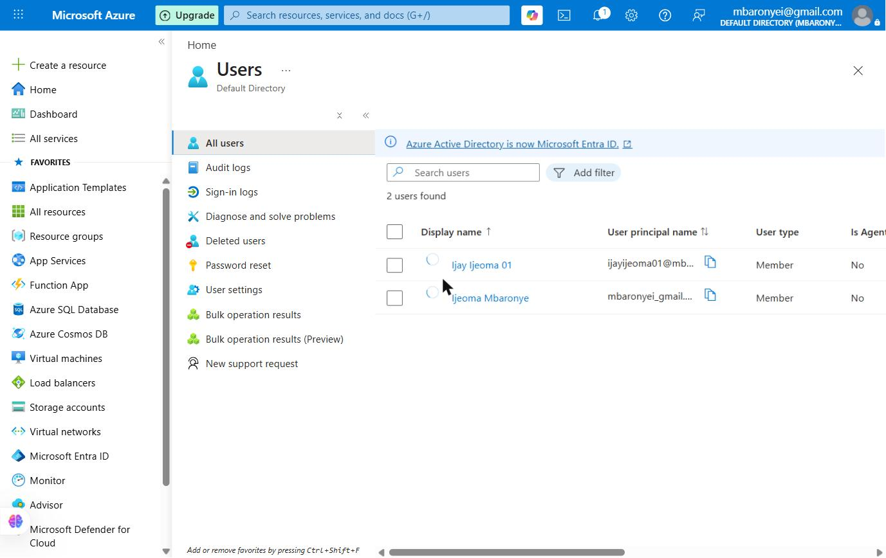
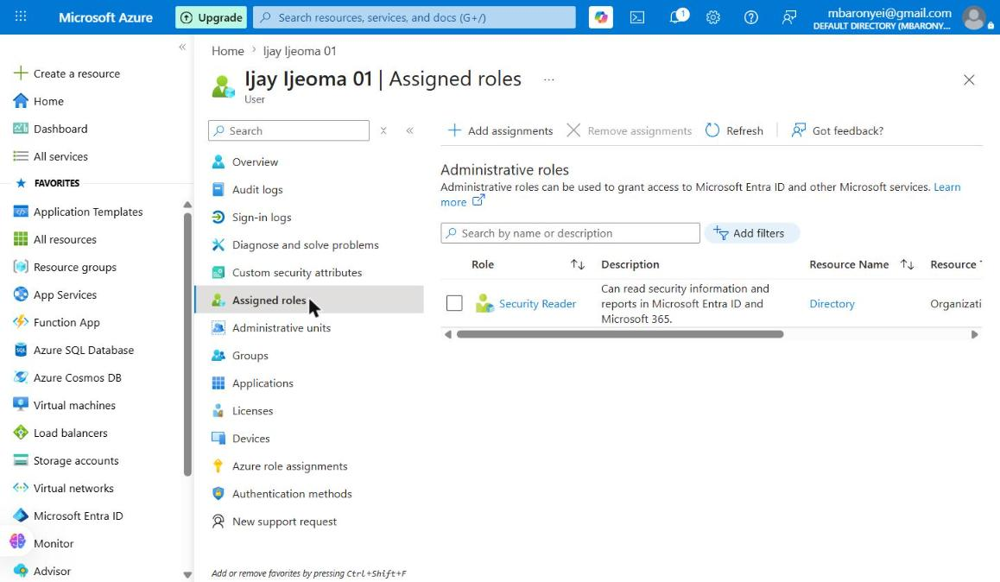
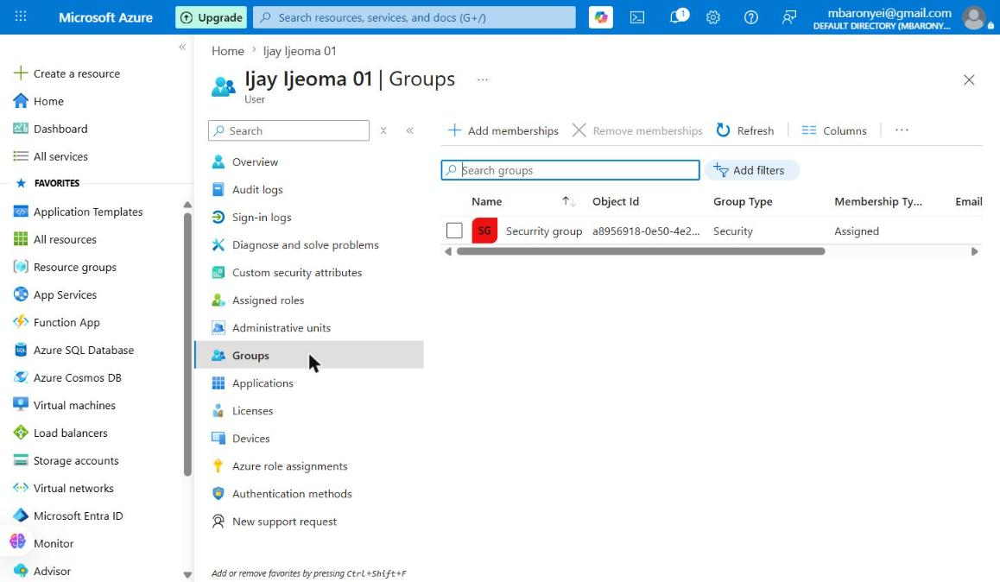
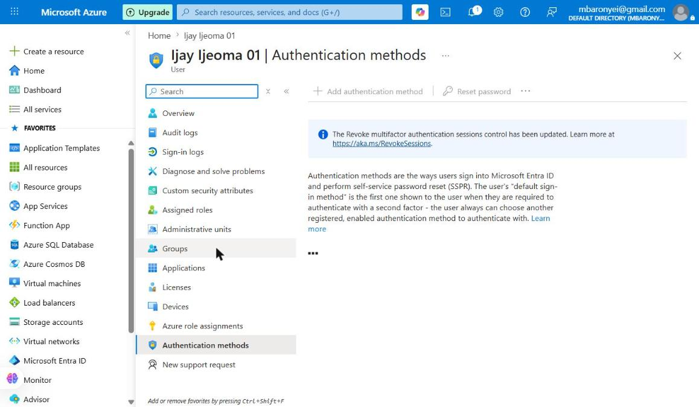
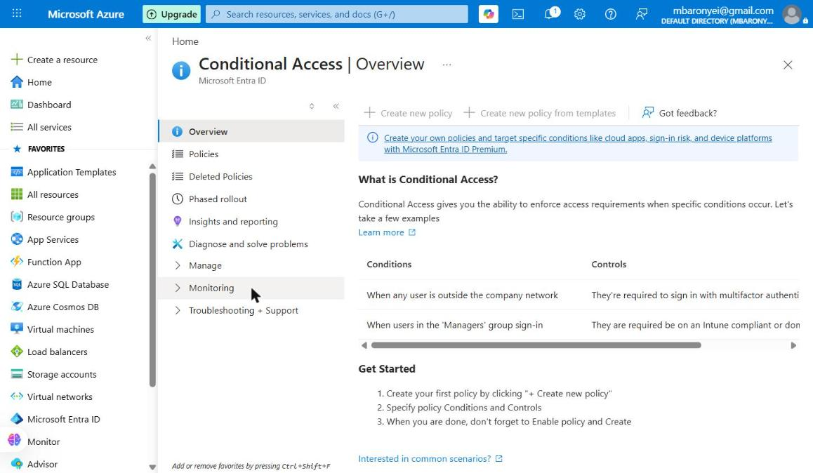

# Project 1: Identity & Access Management (IAM) in Microsoft Azure Entra ID

## Overview
This project demonstrates hands-on implementation of Identity and Access Management (IAM) using Microsoft Azure Entra ID (formerly Azure Active Directory). It covers the full lifecycle of user identity management — a foundational skill for any Cloud Security Engineer.

## Skills Demonstrated
- User creation and identity management in Microsoft Entra ID
- Role-Based Access Control (RBAC)
- Security Group creation and membership management
- Authentication methods and MFA concepts
- Conditional Access policy concepts and licensing awareness

## Tools & Platform
- Microsoft Azure (Free Tier)
- Microsoft Entra ID (Azure Active Directory)

---

## Step 1: User Creation

A new internal user was created in Microsoft Entra ID with the following identity:

- **Display name:** Ijay Ijeoma 01
- **User principal name:** ijayijeoma01@mbaronyeigmail.onmicrosoft.com
- **User type:** Member
- **Job title:** Security Analyst
- **Department:** IT Security
- **Account status:** Enabled
- **Password:** Auto-generated (enforces secure credential handling)

**Why this matters:** Every cloud security incident begins with an identity. Properly provisioning users with accurate metadata ensures accountability, auditability, and the ability to apply the right access policies.

---

## Step 2: Role Assignment (RBAC)

The **Security Reader** role was assigned to the new user.

- **Role:** Security Reader
- **Scope:** Directory-wide (Organization)
- **Description:** Can read security information and reports in Microsoft Entra ID and Microsoft 365

**Why this matters:** Role-Based Access Control (RBAC) is one of the most important concepts in cloud security. Instead of giving users individual permissions, you assign them a role with a defined set of permissions. This is scalable, auditable, and enforces the Principle of Least Privilege — giving users only the access they need and nothing more.

The Security Reader role is a perfect example of least privilege — a security analyst can view security reports and alerts without being able to make changes that could impact the environment.

---

## Step 3: Security Group Creation & Membership

A Security Group was created and the user was added as a member.

- **Group type:** Security
- **Membership type:** Assigned
- **Member:** Ijay Ijeoma 01

**Why this matters:** In real organizations, you manage access at the group level, not the individual user level. By assigning a user to a security group, you can control access to resources, apply policies, and manage permissions for many users at once. This is far more scalable than managing permissions per user.

---

## Step 4: Authentication Methods (MFA)

The Authentication Methods section was explored for the user.

**Key concepts learned:**

- **Per-user MFA:** Manually adding phone/email authentication for a specific user. This is the legacy approach.
- **Policy-based MFA (Conditional Access):** The modern recommended approach where MFA is enforced through policy rather than per-user configuration.
- **SSPR (Self-Service Password Reset):** Users can reset their own passwords using registered authentication methods, reducing helpdesk burden.

**Why this matters:** MFA is one of the single most effective controls against account compromise. Microsoft reports that MFA blocks over 99.9% of account takeover attacks. Understanding how to configure and enforce it is a core cloud security skill.

---

## Step 5: Conditional Access (Concept & Licensing)

The Conditional Access section of Microsoft Entra ID was explored.

**What Conditional Access does:**
Conditional Access is Azure's "if this, then that" security policy engine. It evaluates conditions at sign-in time and enforces controls based on:

| Condition | Example Control |
|-----------|----------------|
| User is outside the company network | Require MFA |
| User is in the 'Managers' group | Require compliant device |
| Sign-in risk is detected as High | Block access |
| User is accessing a sensitive app | Require MFA + compliant device |

**Licensing Note:**
Full Conditional Access policy creation requires **Microsoft Entra ID P1 or P2 (Premium)** licensing. This feature was explored and understood conceptually. In enterprise environments, this would be one of the first security controls configured after user provisioning.

**Why this matters:** Conditional Access is the backbone of Zero Trust security in Microsoft environments. The principle of "never trust, always verify" is implemented directly through Conditional Access policies.

---

## Step 6: Password Reset (Admin-Initiated)

An admin-initiated password reset was performed for Ijay Ijeoma 01.

- **Action:** Reset password via Azure Entra ID user profile
- **Result:** A temporary password was auto-generated by Azure
- **Behaviour:** The user will be forced to change the password on first login

**Why this matters:** In real organizations, admins regularly reset passwords 
for new users or after account lockouts. The temporary password must always be 
communicated through a secure channel — never plain text email or chat. 
Azure enforces a mandatory password change on first sign-in, ensuring the 
admin never knows the user's final password.

## Key Security Concepts Applied

**Principle of Least Privilege:** Users are given only the minimum access required to perform their job — demonstrated through the Security Reader role assignment.

**Identity as the Security Perimeter:** In cloud environments, identity is the new perimeter. Controlling who has access, how they authenticate, and under what conditions they can access resources is the foundation of cloud security.

**Defense in Depth:** This project layers multiple controls — strong passwords (auto-generated), role-based access, group-based management, and MFA readiness — representing a layered security approach.

---

## Author
**Ijeoma Mbaronye**
Aspiring Cloud Security Engineer | Microsoft Azure | Cybersecurity
